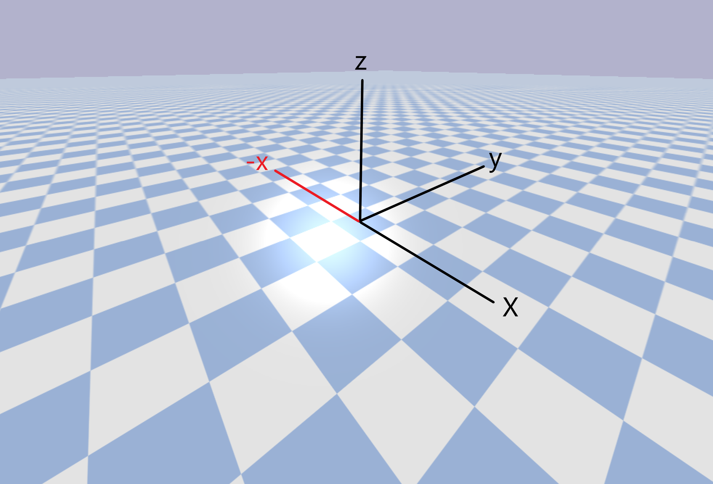
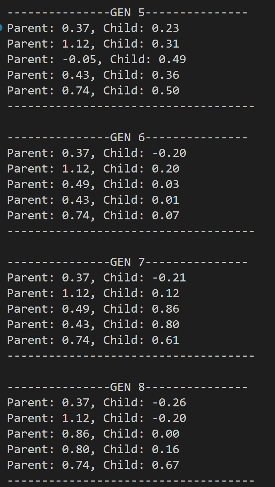
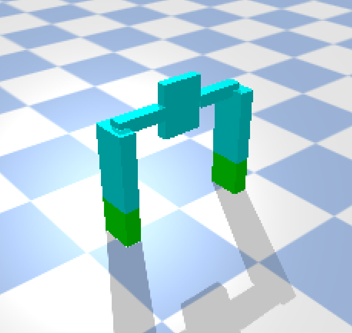
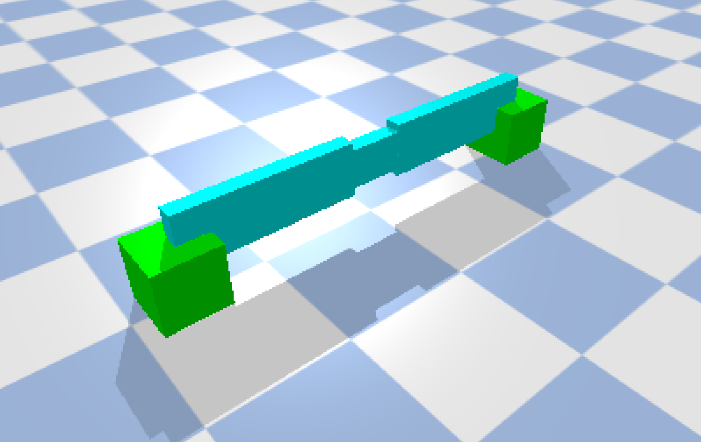
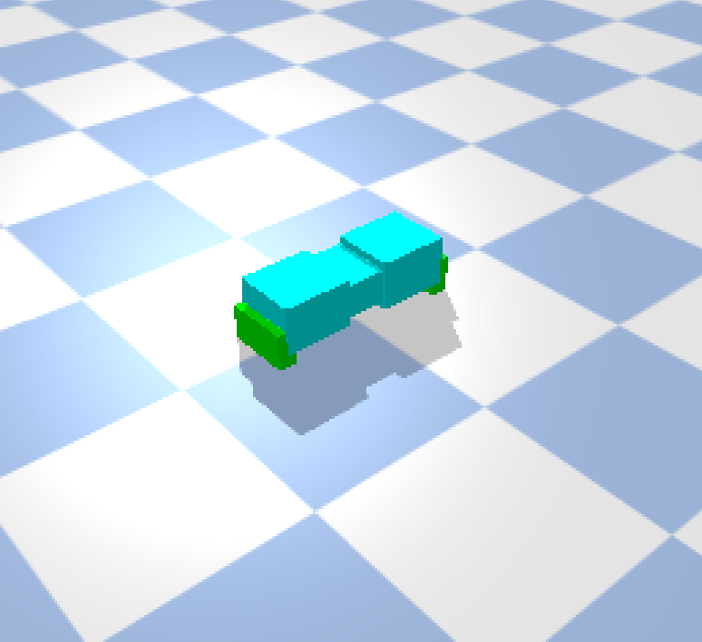
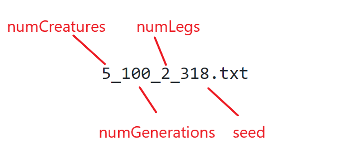
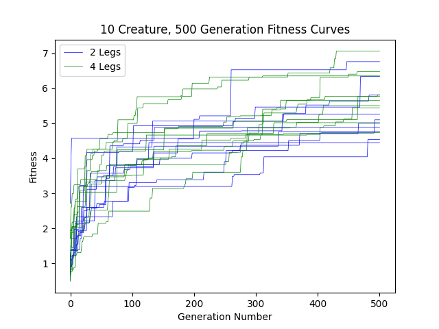
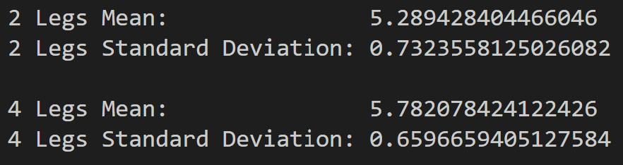
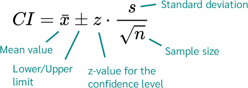
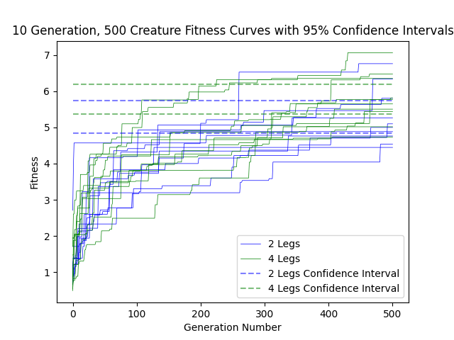

# CS396 - Final Project - Scientist Option
This code base was built For CS396 at Northwestern University. Its foundation was written by following the MOOC found on the subreddit r/ludobots, which includes forking the PryoSim repository https://github.com/jbongard/pyrosim.git. The physics is simulated using PyBullet. The goal of this assignment is the create and test a hypothesis regarding the evolution of these virtual creatures - this hypothesis and experiment can be found at the bottom of this page along with a short summary video.

### Teaser

### Summary

### Body Generation

The inspiration for my creatures was to resemble centipedes. I decided 4 distinct types of links were necessary for this, which I called Torso, Body, Leg, and Foot links:

The algorithm I created for generating the above creature simplifies to this:

And once implemented produces a creature like this:

The code has many parameters which can be changed to alter the creature generation. It is possible for there to be multiple leg links connected to each other, as with foot links. The size of each type of link can be modified along with how many torso links there should be, how many body links between each torso, how many links each leg has, and how many links each foot has. These parameters are randomly assigned in the constructor of *solution.py*

The algorithm utilizes recursion and variables that store how many of each type of link have been created thus far. There are individual functions for creating each type of link which may call themselves or the other functions depending on how far along the algorithm. Revolute joints are created between each adjacent link. Torso_Leg and Leg_Leg joints rotate around the x-axis. Leg_Foot and Foot_Foot joints rotate around the y axis. Torso_Torso, Torso_Body, and Body_Body joints rotate 
around the z-axis

### Body Evolution

Bodily evolution is simple. A random type of link is chosen to be mutated. One of the 4 parameters is chosen to be mutated (number, length, width, height). This parameter is changed by a random amount (float for size, integer for number), and there are checks in place to ensure nothing is 0 (except for body link number which cannot be negative)

### Brain Generation

The brain consists of sensor neurons in every bottom foot (colored green in the simulation) and motor neurons in every joint. Coding this part is straightforward - the complexity arises from the synaptic structure. A sensor neuron for a given foot is connected to every joint up the foot, through the leg, and within the foot and leg coming out of the same torso link. It will also be connected to the Torso_Body joints that connect its torso to the next torso link in either direction, a drawing of which can be seen below. This is done in code via math involving the parameters that determine the number of each type of link which can be found in *solution.py*'. Every synapse is given a random weight between -1 and 1

### Brain Evolution

The brain evolves by picking a random synapse and changing its weight to a random number. If there are new links in the body's mutation, new synapses are created accordingly with random weights. If there were links removed in the body's mutation, those synapses are removed.

### Evolutionary Algorithm

The fitness of a creature is determined by how far in the negative x direction (left and into the screen, as seen highlighted in red below) it reaches by the end of the simulation.

I am using a parallel hill climber to perform evolution. Any number of creatures can be chosen to evolve for any number of generations. Each creature is randomly generated to start. For every generation, each creature creates a "child" creature that is identical to itself aside from 1 bodily mutation and 1 neurological mutation, as described in the evolution sections above. If the child performs better than its parent, it replaces the parent along that creature's lineage. Otherwise, the parent continues. All creatures undergo this process in parallel, generation by generation, and the fitness values are printed to the terminal, as seen here:

The above image also does an excellent job illustrating how hill climbing works. Examining the 3rd creature, we can see that in generation 5 the child has better fitness than the parent. So, the child replaces the parent, and in generation 6 we see that the parent's fitness is the same as generation 5's child's fitness because it has been replaced. In generation 6, the child's fitness is worse than the parent, so no change is kept for the next generation. Then, in generation 7, again the child is an improvement from the parent so it replaces the parent for the next generation.

### Hypothesis

My hypothesis was that bipedal creatures were able to achieve better fitness than quadrupedal creatures under my evolutionary conditons. This was inspired by my work done for assignment eight, as seen in the *assignmentEight* branch of this repository. It seemed to me that the creatures that ended up bipedal achieved better looking gaits. Perhaps this was due to having more simple bodies that allowed the brain to be more optimized, or perhaps this was due to my bias as a bipedal human. There's only one way to find out - run an experiment!

### Executable

- Run "python search.py [numCreatures] [numGenerations] [numLegs] [seed]", where [seed] is optional and [numLegs] must be an even number
  -  "python search.py 5 20 4 12" would evolve 5 quadrupedal creatures in parallel for 20 generations with random seed 12
  -  "python search.py 10 100 2" would evolve 10 bipedal creatures in parallel for 100 generations, with a seed that is randomly generated
-  The fitness of the best creature in every generation will be output into a file named *numCreatures_numGenerations_numLegs_seed.txt* in a directory named *FitnessData*
-  The best creature of the first generation will be shown at the beginning, and the best creature of the final generation will be shown at the end

### Experimental Design

To run this experiment, I altered the body generation to have a fixed number of legs at the start. When the user runs *search.py*, they specify the number of legs they'd like. This information is passed into *constants.py*, and then accessed in the constructor of *solution.py*. Every torso link is defined to have 2 legs coming out of it, so the number of torso links at the start is defined to be *numLegs*/2 rather than a randomly generated number as it was previously. Even with a fixed number of legs, such as 2, a wide variety of bodies can be randomly generated:

    

The body mutation also had to be altered. It was previously possible for the number of torso links (and thus legs) to be mutated, but I changed it so this parameter cannot be changed. This was done by changing some functions in *solution.py*, where the code that controls mutation can be found.

Now that number of legs is fixed, simulations can be run. My control group was quadrupeds - I ran 10 separate simulations of 10 quadrupedal creatures evolving for 500 generations. The experimental group was 10 separate simulations of 10 bipedal creatures evolving for 500 generations. The seeds for all of these simulations were randomly chosen within the code, as in I ran "python search.py 10 500 [numLegs]" with no 4th argument. This was a total of 100,000 individual fitness tests, which is above our required 50,000 for class and enough that I thought I could get some usable data.

The data for all 20 of these simulations can be found in the *FitnessData* directory. As a reminder, the numbers in each text file indicate the arguments that *search.py* was run with, as seen here: 

<kbd></kbd>

So, to verify these results, one could run "python search.py [numCreatures] [numGenerations] [numLegs] [seed]" for every .txt file and should get the same results.
 
### Results

I implemented code in *analyze.py* to plot fitness curves that show the best creature at every generation for every simulation, where the color of the curve indicates how many legs the creatures in that simulation were fixed at:

From a quick glance, there is no striking difference between quadrupedal and bipedal creatures. The quadrupeds appear to be clumped slightly higher than the bipeds, which is the opposite of my hypothesis. The graph is not conclusive, however, so I decided to add code to *analyze.py* that outputs the average final fitness for bipeds and quadrupeds along with their standard deviations:

This supports the claim that the quadrupeds have higher final fitness value on average. But, given the relatively small difference in means and small sample size of only 10, I decided to add code to *analyze.py* to display a 95% confidence interval for the mean final fitness for bipeds and quadrupeds using the following formula with z = 1.96 (image from https://datatab.net/tutorial/confidence-interval):

<kbd></kbd>

The following plot was produced:

As can be seen in the above plot, the intervals are overlapping and thus inconclusive. Typically, 95% confidence intervals are what is expected for conclusive evidence in an experiment. But out of curiosity, I wanted to find the highest percentage confidence intervals that don't overlap. Through trial and error, I found that 70% confidence intervals (z = 1.03) look pretty good:

The code in *analyze.py* right now would produce the plot with 95% confidence intervals as well as printing the statistics to the terminal. Lines 68 and 69 can be altered to produce confidence intervals for different percentages if the 1.96 is changed to another z value.

### Conclusion

In conclusion, no evidence was found to support the hypothesis that bipedal creatures achieve higher fitness values than quadrupedal creatures. In fact, I could say with 70% confidence that quadrupeds have a better mean final fitness value than bipeds based on my data, though this is not a high enough probability to make that conclusion. There is stil a 30% chance that the true mean fitness values are identical or the bipedal is higher.

If I had more time, I would absolutely run more simulations for 2 legged and 4 legged creatures. Maybe with a sample size greater than 10, proper confidence intervals could be constructed to support my hypothesis (or, it seems more likely, the opposite of my hypothesis). I would also be curious to test other amounts of legs too. Maybe the more legs the better? Or maybe 4 is a goldilocks zone where more legs is too much.

If anyone stumbles across this and wants to use my code base to conduct their own experiments, feel free! Please cite my work of course and definitely let me know what you discover. Thank you for reading!
