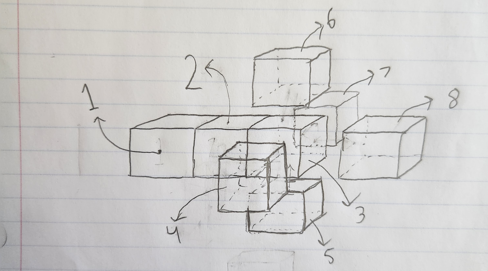
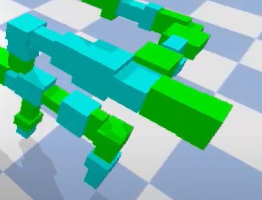

# CS396 - Assignment 7
This code base was built For CS396 at Northwestern University. Its foundation was written by following the MOOC found on the subreddit r/ludobots, which includes forking the PryoSim repository https://github.com/jbongard/pyrosim.git. The physics is simulated using PyBullet

**VIDEO**: 

https://youtu.be/lAxipjH3Vbc

**INSTRUCTIONS**: 

Run python search.py to randomly create and simulate a body and brain. Run it mulitple times to see the variety in possible creatures

**BODY DESCRIPTION**:

In the following description, refer to this diagram for cube numbers:

Links are created using a custom made function. This function takes in a position for the joint that will connect this new link to previous link, as well as a direction that the new link is being placed in. Imagine we create link 3 using this function - it will be given a position for a joint that is placed in the middle of the right face of link 2, and told the direction is to the right. Joints are created to either be around the X axis, Y axis, or Z axis, each with 33% probability, and all links given random length, width, and heights.

After creating the link, the function uses probabilities defined earlier in the code to determine if links are placed in positions 4, 5, 6, 7, or 8. It is possible for none of these to be placed, or all of them. The function recursively calls itself with the correct joint position and direction depending on which of the positions it placing the next link in, creating branching structures like this:

It is possible for links to spawn overlapping, but it is impossible that the joints they were spanwed connected to are the same, so once the simulation starts the links are not coupled together. In other words, it is the same physics as two links from separate limbs happening to pass through each other during simulation, which to my understanding is allowed in our implementation for assignment 7.
