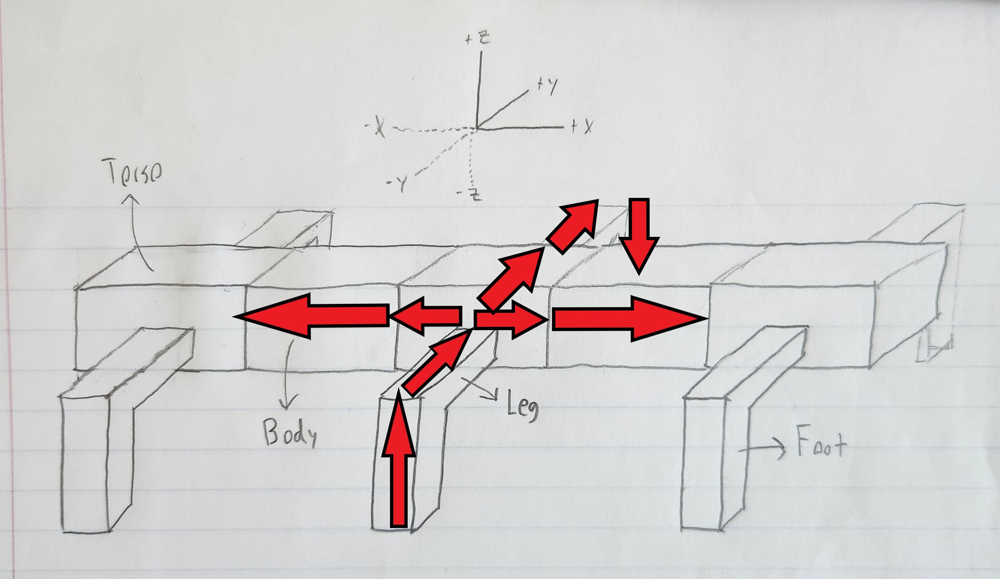

# CS396 - Final Project - Scientist Option
This code base was built For CS396 at Northwestern University. Its foundation was written by following the MOOC found on the subreddit r/ludobots, which includes forking the PryoSim repository https://github.com/jbongard/pyrosim.git. The physics is simulated using PyBullet. The goal of this assignment is the create and test a hypothesis regarding the evolution of virtual creatures - this hypothesis and experiment can be found at the bottom of this page along with a short summary video.

**BODY GENERATION:**

The inspiration for my creatures was to resemble centipedes. I decided 4 distinct types of links were necessary for this, which I called Torso, Body, Leg, and Foot links:

The algorithm I created for generating the above creature simplifies to this:

And once implemented produces a creature like this:

The code has many parameters which can be changed to alter the creature generation. It is possible for there to be multiple leg links connected to each other, as with foot links. The size of each type of link can be modified along with how many torso links there should be, how many body links between each torso, how many links each leg has, and how many links each foot has. These parameters are randomly assigned in the constructor of *solution.py*

The algorithm utilizes recursion and variables that store how many of each type of link have been created thus far. There are individual functions for creating each type of link which may call themselves or the other functions depending on how far along the algorithm. Revolute joints are created between each adjacent link. Torso_Leg and Leg_Leg joints rotate around the x-axis. Leg_Foot and Foot_Foot joints rotate around the y axis. Torso_Torso, Torso_Body, and Body_Body joints rotate 
around the z-axis

**BODY EVOLUTION:**

Bodily evolution is simple. A random type of link is chosen to be mutated. One of the 4 parameters is chosen to be mutated (number, length, width, height). This parameter is changed by a random amount (float for size, integer for number), and there are checks in place to ensure nothing is 0 (except for body link number which cannot be negative)

**BRAIN GENERATION:**

The brain consists of sensor neurons in every bottom foot (colored green in the simulation) and motor neurons in every joint. Coding this part is straightforward - the complexity arises from the synaptic structure. A sensor neuron for a given foot is connected to every joint up the foot, through the leg, and within the foot and leg coming out of the same torso link. It will also be connected to the Torso_Body joints that connect its torso to the next torso link in either direction, a drawing of which can be seen below. This is done in code via math involving the parameters that determine the number of each type of link which can be found in *solution.py*'. Every synapse is given a random weight between -1 and 1

**BRAIN EVOLUTION:**

The brain evolves by picking a random synapse and changing its weight to a random number. If there are new links in the body's mutation, new synapses are created accordingly with random weights. If there were links removed in the body's mutation, those synapses are removed.

**HYPOTHESIS:**

**TEASER:**

**SUMMARY:**

**EXECUTABLE:**

**EXPERIMENTAL DESIGN:**

**RESULTS:**

**CONCLUSION:**
